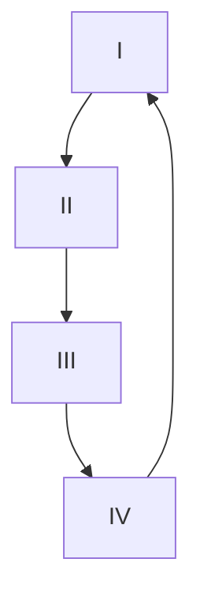

高木贞治（1875–1960）创作的《数学分析概论》被誉为日本现代数学发展的“不动之根基”。

## 第 1 章 基本概念

### §1 数的概念

本书并没有在有理数的基础上构造实数，而是采用公理化方法，只是作者并没有一一列举出这些公理（算术运算法则和序关系），而假设读者对这些公理及其简单推论都已然熟悉。这当然可以帮助读者快速地进入分析学的核心。

### §2 数的连续性

> <strong id="theorem-1">定理 1</strong> &emsp; 实数的分割确定某数为下类和上类的边界。
{: .prompt-info }

说是定理，其实作者并没有给出证明，所以这其实是一个公理。它表达的是实数的连续性。

### §3 数的集合·上确界·下确界

> <strong id="theorem-2">定理 2（魏尔斯特拉斯定理）</strong> &emsp; 若数集 $S$ 在上方（或下方）有界，则 $S$ 的上确界（或下确界）存在。
{: .prompt-info }

证明：设 $S$ 有上界。令 $A'$ 为 $S$ 的上界组成的集合，$A$ 为 $A'$ 在实数集上的补集，则显然 $A,A'$ 构成了实数集的一个分割。根据定理 1，存在一实数 $\alpha$，要么是 $A$ 的最大数，要么是 $A'$ 的最小数。

假设 $\alpha \in A$，则因为 $\alpha$ 不是 $S$ 的上界，所以存在 $s \in S$ 满足 $\alpha < s$。又因为 $\alpha$ 是 $A$ 的最大数，由 $\alpha < s$ 可知 $s \in A'$。根据实数的稠密性可知，存在实数 $a$ 满足 $\alpha < a < s$。由 $\alpha < a$ 可知 $a \in A'$；由 $a < s$ 可知 $a$ 不是 $S$ 的上界，即 $a \in A$。此矛盾便证明 $\alpha \notin A$。

因此，$\alpha$ 是 $A'$ 的最小数，即 $S$ 的上界的最小者，即 $S$ 的上确界。$\square$

### §4 数列的极限

如果下标 $n$ 无限增大时，数列 $\\{a_n\\}$ 无限接近实数 $\alpha$，则称 $\alpha$ 为 $\\{a_n\\}$ 的**极限**，或称 $\\{a_n\\}$ **收敛**于 $\alpha$。如何将“无限增大”、“无限接近”这种模糊的表述换成精确的定义呢？可以这样表达：

若对任意的正实数 $\varepsilon$，存在下标 $n_0$，当 $n > n_0$ 时，有 $\|a_n - \alpha\| < \varepsilon$，则称 $\alpha$ 为 $\\{a_n\\}$ 的极限。

数列的极限是唯一的。假设 $\\{a_n\\}$ 有两个极限 $\alpha,\alpha' (\alpha < \alpha')$，那么根据实数的稠密性，可取一实数 $\beta (\alpha < \beta < \alpha')$。令 $\varepsilon = \min \\{ \beta-\alpha, \alpha'-\beta \\}$，则由 $a_n \to \alpha$ 可知最终有 $a_n < \beta$；由 $a_n \to \alpha'$ 可知最终有 $a_n > \beta$。这一矛盾便证明了 $\\{a_n\\}$ 的极限的唯一性。

> <strong id="theorem-3">定理 3</strong> &emsp; 收敛数列的⼦数列仍收敛到原极限值。
{: .prompt-info }

此定理是数列定义的一个显然的推论。

> <strong id="theorem-4">定理 4</strong> &emsp; 若 $a_n \to \alpha$，则存在常数 $M$，使得 $\|a_n\| < M$。因此有 $\|\alpha\| \leq M$。
{: .prompt-info }

此定理是说，收敛数列必定有界；并且其极限有可能触到其界，但不可能超出其界。

证明：任取一正实数 $E$，由 $a_n \to \alpha$ 可知，存在下标 $n_0$，当 $n > n_0$ 时，有 $\alpha - E < a_n < \alpha + E$。取一实数

$$
M > \max \{ |a_1|, |a_2|, \cdots, |a_{n_0}|, |\alpha - E|, |\alpha + E| \}
$$

则对任意下标 $n$，都有 $\|a_n\| < M$。

假设 $\|\alpha\| > M$。取一正实数 $E < \|\alpha\| - M$，则由 $a_n \to \alpha$ 可知，最终有

$$
\begin{gather*}
\alpha - E < a_n < \alpha + E \\
\Downarrow \\
\alpha - |\alpha| + M < a_n < \alpha + |\alpha| - M
\end{gather*}
$$

当 $\alpha$ 为负时，最终有 $a_n < -M$；当 $\alpha$ 为非负时，最终有 $M < a_n$。这都与 $\|a_n\| < M$ 矛盾。因此，$\|\alpha\| \leq M$。$\square$

> <strong id="theorem-5">定理 5</strong> &emsp; 当 $\\{ a_n \\}, \\{ b_n \\}$ 收敛时下面式子成立。
>
> （1°）$\lim_{n \to \infty} (a_n + b_n) = \lim_{n \to \infty} a_n + \lim_{n \to \infty} b_n$  
> （2°）$\lim_{n \to \infty} (a_n - b_n) = \lim_{n \to \infty} a_n - \lim_{n \to \infty} b_n$  
> （3°）$\lim_{n \to \infty} (a_n b_n) = (\lim_{n \to \infty} a_n) (\lim_{n \to \infty} b_n)$  
> （4°）$\lim_{n \to \infty} \frac{a_n}{b_n} = \frac{\lim_{n \to \infty} a_n}{\lim_{n \to \infty} b_n}$  
>
> 其中，在（4°）中设 $b_n \neq 0$，$\lim_{n \to \infty} b_n \neq 0$。
{: .prompt-info }

证明：设 $a_n \to \alpha, b_n \to \beta$。对任意的正实数 $\varepsilon$，存在下标 $n_0$，当 $n > n_0$ 时，有

$$
|a_n - \alpha| < \frac{\varepsilon}{2}, |b_n - \beta| < \frac{\varepsilon}{2}
$$

于是有

$$
|(a_n \pm b_n) - (\alpha \pm \beta)| = |(a_n - \alpha) \pm (b_n - \beta)| \leq |a_n - \alpha| + |b_n - \beta| < \frac{\varepsilon}{2} + \frac{\varepsilon}{2} = \varepsilon
$$

因此，$a_n \pm b_n \to \alpha \pm \beta$，即（1°）（2°）得证。

对于（3°），可观察到

$$
\begin{align*}
|a_n b_n - \alpha \beta| &= |a_n b_n - \alpha b_n + \alpha b_n - \alpha \beta| \\
&= |(a_n - \alpha) b_n + \alpha (b_n - \beta)| \\
&\leq |a_n - \alpha| |b_n| + |\alpha| |b_n - \beta| \\
\end{align*}
$$

根据定理 4，可知存在一实数 $M$，使得 $\|b_n\| < M$。于是有

$$
|a_n b_n - \alpha \beta| < |a_n - \alpha| M + |\alpha| |b_n - \beta|
$$

再取一实数 $B$ 满足 $B > \max\\{M, \|\alpha\|\\}$，则有

$$
|a_n b_n - \alpha \beta| < B(|a_n - \alpha| + |b_n - \beta|)
$$

对于任意正实数 $\varepsilon$，存在下标 $n_1$，当 $n > n_1$ 时，有

$$
|a_n - \alpha| < \frac{\varepsilon}{2B}, |b_n - \beta| < \frac{\varepsilon}{2B}
$$

于是有

$$
|a_n b_n - \alpha \beta| < B(\frac{\varepsilon}{2B} + \frac{\varepsilon}{2B}) = \varepsilon
$$

因此，$a_n b_n \to \alpha \beta$，即（3°）得证。

对于（4°），可观察到

$$
\begin{align*}
|\frac{a_n}{b_n} - \frac{\alpha}{\beta}| &= |\frac{a_n \beta - b_n \alpha}{b_n \beta}| \\
&= |\frac{a_n \beta - \alpha \beta + \alpha \beta - b_n \alpha}{b_n \beta}| \\
&= |\frac{(a_n - \alpha) \beta + \alpha (\beta - b_n)}{b_n \beta}| \\
&\leq \frac{|a_n - \alpha| |\beta| + |\alpha| |b_n - \beta|}{|b_n| |\beta|} \\
\end{align*}
$$

取一实数 $M$ 满足 $M > \max \\{ \|\alpha\|, \|\beta\|\\}$，则有

$$
|\frac{a_n}{b_n} - \frac{\alpha}{\beta}| < \frac{M(|a_n - \alpha| + |b_n - \beta|)}{|b_n| |\beta|}
$$

如果存在一正实数 $B$ 满足 $B < \|b_n\|$，那么就有

$$
|\frac{a_n}{b_n} - \frac{\alpha}{\beta}| < \frac{M(|a_n - \alpha| + |b_n - \beta|)}{B |\beta|}
$$

对于任意正实数 $\varepsilon$，存在下标 $n_2$，当 $n > n_2$ 时，有

$$
|a_n - \alpha| < \frac{B|\beta|\varepsilon}{2M}, |b_n - \beta| < \frac{B|\beta|\varepsilon}{2M}
$$

于是有

$$
|\frac{a_n}{b_n} - \frac{\alpha}{\beta}| < \frac{M(\frac{B|\beta|\varepsilon}{2M} + \frac{B|\beta|\varepsilon}{2M})}{B |\beta|} = \varepsilon
$$

因此，$a_n/b_n \to \alpha/\beta$，即（4°）得证。

现在回过头去求证 $B$ 的存在。可以取一实数 $E$ 满足 $0 < E < \|\beta\|$，那么存在下标 $n_0$，对 $n > n_0$，有

$$
\begin{gather*}
|b_n - \beta| < E \\
\Downarrow \\
\beta - E < b_n < \beta + E \\
\end{gather*}
$$

令 $0 < B < \min\\{ \|b_1\|, \|b_2\|, \cdots, \|b_{n_0}\|, \|\beta\| - E \\}$，则对任意下标 $n$，有 $B < \|b_n\|$。$\square$

> <strong id="theorem-6">定理 6</strong> &emsp; 单调有界数列收敛。
{: .prompt-info }

证明：设数列 $\\{a_n\\}$ 单调非减，且有上界，那么根据魏尔斯特拉斯定理，存在 $\\{a_n\\}$ 的上确界 $\alpha$。因为 $\alpha$ 为 $\\{a_n\\}$ 的上界，所以对任意下标 $n$ 有 $a_n \leq \alpha$。因为 $\alpha$ 为 $\\{a_n\\}$ 的上确界，所以对任意的正实数 $\varepsilon$，$\alpha - \varepsilon$ 不是 $\\{a_n\\}$ 的上界；故存在一下标 $n_0$ 满足 $\alpha - \varepsilon < a_{n_0}$。又因为 $\\{a_n\\}$ 单调非减，故对所有 $n > n_0$，有 $\alpha - \varepsilon < a_{n_0} \leq a_n$。综上，$a_n \to \alpha$。$\square$

> <strong id="example-1">【例 1】</strong> &emsp; 若 $a > 0$，则 $\lim_{n \to \infty} \sqrt[n]{a} = 1$。
{: .prompt-info }

证明：若 $a > 1$，则显然有 $\sqrt[n]{a} > 1$。接下来尝试证明，对任意的正实数 $\varepsilon$，存在下标 $n_0$ 满足 $\sqrt[n_0]{a} < 1 + \varepsilon$；如此，根据 $\\{\sqrt[n]{a}\\}$ 的单调递减性质，可知对所有 $n > n_0$，有

$$
\sqrt[n]{a} < \sqrt[n_0]{a} < 1 + \varepsilon
$$

这就证明了 $\sqrt[n]{a} \to 1$。

为此，假设存在一正实数 $E$，对任意下标 $n$ 有 $\sqrt[n]{a} \geq 1 + E$，则有

$$
\begin{gather*}
a \geq (1+E)^n = 1 + nE + \cdots > nE \\
\Downarrow \\
n < \frac{a}{E}
\end{gather*}
$$

此不等式无法对充分大的下标 $n$ 成立。这一矛盾便证明了上面的结论。

若 $a = 1$，则显然有 $\sqrt[n]{a} \to 1$。

若 $a < 1$，则令 $a = 1/b$，于是 $b > 1$。根据定理 5，可知 $\sqrt[n]{a} \to 1$。$\square$

> <strong id="example-2">【例 2】</strong> &emsp; 若 $a > 1$，$k > 0$，则当 $n \to \infty$ 时，有 $\frac{a^n}{n^k} \to \infty$。
{: .prompt-info }

证明：当 $k = 1$ 时，由 $a > 1$，可令 $a = 1 + h$，其中 $h > 0$。于是有

$$
\frac{a^n}{n} = \frac{(1+h)^n}{n} = \frac{1}{n} + h + \frac{(n-1)}{2} h^2 + \cdots > \frac{(n-1)}{2} h^2
$$

不等式右边可大于任意实数，故 $\frac{a^n}{n}$ 也可大于任意实数，即 $\frac{a^n}{n} \to \infty$。

当 $0 < k < 1$ 时，由 $\frac{a^n}{n^k} > \frac{a^n}{n}$ 可知 $\frac{a^n}{n^k} \to \infty$。

当 $k > 1$ 时，有

$$
\frac{a^n}{n^k} = (\frac{(\sqrt[k]{a})^n}{n})^k
$$

因为 $\sqrt[k]{a} > 1$，所以我们可以利用上面已经证明的结论得出 $\frac{(\sqrt[k]{a})^n}{n} \to \infty$；因此，$\frac{a^n}{n^k} \to \infty$。$\square$

当 $k > 1$ 时，虽然 $n^k$ 也可无限增大，但其因子数 $k$ 是固定的；而 $a^n$ 的因子数却可以无限多。因此，$a^n$ 的增速远大于 $n^k$。

> <strong id="example-3">【例 3】</strong> &emsp; 若 $a > 0$，则 $\lim_{n \to \infty}\frac{a^n}{n!} = 0$。
{: .prompt-info }

证明：可取一下标 $k$ 满足 $k > 2a$，那么对于 $n > k$，有

$$
\begin{align*}
\frac{a^n}{n!} &= \frac{a}{n} \frac{a}{n-1} \cdots \frac{a}{k+1} \frac{a^k}{k!} \\
    &< \frac{a}{k} \frac{a}{k} \cdots \frac{a}{k} \frac{a^k}{k!} \\
    &= (\frac{a}{k})^{n-k} \frac{a^k}{k!} \\
    &< \frac{1}{2^{n-k}} \frac{a^k}{k!} \\
\end{align*}
$$

显然，$\frac{1}{2^{n-k}} \frac{a^k}{k!}$ 是收敛于 $0$ 的，故 $\frac{a^n}{n!} \to 0$。$\square$

$a^n$ 和 $n!$ 的因子数是相同的，但 $a^n$ 的每个因子是固定的，都是 $a$；只要 $n$ 足够大，$n!$ 的大多数因子将远超 $a$。

> <strong id="example-4">【例 4】</strong> &emsp; 若 $a_n \to \alpha$，则 $\frac{a_1 + a_2 + \cdots + a_n}{n} \to \alpha$。
{: .prompt-info }

证明：令 $b_n = a_n - \alpha$，则只需证明 $\frac{b_1 + b_2 + \cdots + b_n}{n} \to 0$ 即可。

由 $b_n \to 0$ 可知，对任意正实数 $\varepsilon$，存在下标 $n_0$，当 $n > n_0$ 时，有 $\|b_n\| < \varepsilon$。于是有

$$
\begin{align*}
|\frac{b_1 + b_2 + \cdots + b_n}{n}| &\leq \frac{|b_1| + |b_2| + \cdots + |b_{n_0}| + (n-n_0)\varepsilon}{n} \\
    &< \frac{|b_1| + |b_2| + \cdots + |b_{n_0}|}{n} + \varepsilon
\end{align*}
$$

不等式右边可无穷小，故 $\frac{b_1 + b_2 + \cdots + b_n}{n} \to 0$。$\square$

> <strong id="example-5">【例 5】</strong> &emsp; （$e$ 的定义）设 $a_n = (1+\frac{1}{n})^n$，根据二项式定理，有
>
> $$
> \begin{align*}
> a_n &= 1 + \frac{n}{1!}\frac{1}{n} + \frac{n(n-1)}{2!}\frac{1}{n^2} + \frac{n(n-1)(n-2)}{3!}\frac{1}{n^3} + \cdots + \frac{1}{n^n} \\
> &= 1 + 1 + \frac{1-\frac{1}{n}}{2!} + \frac{(1-\frac{1}{n})(1-\frac{2}{n})}{3!} + \cdots + \frac{(1-\frac{1}{n})(1-\frac{2}{n})\cdots(1-\frac{n-1}{n})}{n!}
> \end{align*}
> $$
>
> 用 $n+1$ 代替 $n$，则右边各项增大并且项数增加，所以数列 $\\{a_n\\}$ 单调递增。又由上面等式可知
>
> $$
> \begin{align*}
> a_n &< 1 + \frac{1}{1!} + \frac{1}{2!} + \frac{1}{3!} + \cdots + \frac{1}{n!} \\
> &< 1 + 1 + \frac{1}{2} + \frac{1}{2^2} + \cdots + \frac{1}{2^{n-1}} < 3
> \end{align*}
> $$
>
> 即 $\\{a_n\\}$ 单调递增且有界，所以收敛。在古典数学中，将该极限值定义为 $e$。
{: .prompt-info }

### §5 区间套法

> <strong id="theorem-7">定理 7</strong> &emsp; 设闭区间 $I_n = [a_n, b_n] (n=1,2,\cdots)$ 满足：
>
> （1°）各区间 $I_n$ 包含于在它之前的区间 $I_{n-1}$ 中，  
> （2°）当 $n$ 无限增大时，区间 $I_n$ 的长度 $b_n - a_n$ 无限减小，
>
> 则各区间存在唯一一个公共点。
{: .prompt-info }

证明：设 $A$ 为所有 $a_n$ 构成的集合，则 $A$ 显然有上界。根据魏尔斯特拉斯定理，存在 $A$ 的上确界 $\alpha$。因为 $\alpha$ 是 $A$ 的上界，故有 $a_n \leq \alpha$；因为 $\alpha$ 是 $A$ 的上确界，而 $b_n$ 是 $A$ 的上界，故有 $\alpha \leq b_n$。综上，$\alpha$ 是 $I_n$ 的公共点。

如果 $I_n$ 有两个不同的公共点 $\alpha, \alpha' (\alpha < \alpha')$，则有 $b_n - a_n \geq \alpha' - \alpha$；这就与 $b_n - a_n$ 无限减小矛盾了。$\square$

作者利用定理 6 来证明此定理；其证明过程也很简单。作者这样安排，是想用一个循环因果链来证明四条关于实数连续性的基本定理的等价性：

- （I）戴德金定理（定理 1）
- （II）魏尔斯特拉斯定理（定理 2）
- （III）单调有界数列收敛（定理 6）
- （IV）区间套法（定理 7）

这样，这四个定理中的每一个都可以作为公理，以此为出发点构建分析学。

现在假设区间套法成立，然后来证明戴德金定理：设 $A,B$ 构成实数集的一个分割，在 $A$ 中任取一数 $a_1$，在 $B$ 中任取一数 $b_1$，构成闭区间 $I_1 = [a_1, b_1]$；然后考察其中点 $c_1 = \frac{a_1+b_1}{2}$，如果 $c_1 \in A$，则令 $a_2 = c_1, b_2 = b_1$；如果 $c_1 \in B$，则令 $a_2 = a_1, b_2 = c_1$；由此得到闭区间 $I_2 = [a_2, b_2]$。以此类推，得到一个闭区间套 $\\{I_n\\}$；显然，其区间长度是无限减小的。

根据区间套法，存在唯一一个实数 $\alpha$ 为所有闭区间 $I_n$ 的公共点。现需证明，$\alpha$ 要么是 $A$ 的最大数，要么是 $B$ 的最小数。

如果 $\alpha \in A$，假设存在 $a \in A$ 满足 $\alpha < a$，则因为 $a_n \leq \alpha$，所以 $a_n < a$；又因为所有 $b_n \in B$，故有 $a < b_n$。如此一来，$a$ 也是所有闭区间 $I_n$ 的公共点，与区间套法矛盾。这就证明了 $\alpha$ 是 $A$ 的最大数。

同理可证，如果 $\alpha \in B$，则 $\alpha$ 是 $B$ 的最小数。$\square$

### §6 收敛条件与柯西判别法

> <strong id="theorem-8">定理 8</strong> &emsp; 数列 $\\{a_n\\}$ 收敛的充分必要条件是，对于任意的 $\varepsilon > 0$，存在与之对应的序号 $n_0$，使得
>
> $$
> \text{当 } p > n_0, q > n_0 \text{ 时，有 } |a_p - a_q| < \varepsilon
> $$
{: .prompt-info }

证明：先证明必要性。设 $a_n \to \alpha$，则对任意的正实数 $\varepsilon$，存在序号 $n_0$，使得当 $p,q > n_0$ 时，有

$$
|a_p - \alpha| < \frac{\varepsilon}{2}, |a_q - \alpha| < \frac{\varepsilon}{2}
$$

于是，

$$
|a_p - a_q| = |a_p - \alpha + \alpha - a_q| \leq |a_p - \alpha| + |\alpha - a_q| < \frac{\varepsilon}{2} + \frac{\varepsilon}{2} = \varepsilon
$$

再证明充分性。假设 Cauchy 条件成立。任取一正实数 $E$，则存在序号 $n_0$，使得当 $p,q > n_0$ 时，有 $\|a_p - a_q\| < E$。任意选取一固定的 $q$，则有

$$
a_q - E < a_p < a_q + E
$$

由此可知，$\\{a_n\\}$ 是有界的。

对任意的序号 $n$，设 $a_n, a_{n+1}, \cdots$ 的上确界和下确界分别为 $l_n, m_n$，则易知有如下关系：

$$
m_1 \leq m_2 \leq \cdots \leq m_n \leq \cdots \leq l_n \leq \cdots \leq l_2 \leq l_1
$$

令闭区间 $I_n = [m_n, l_n]$，则得到一个闭区间套 $\\{I_n\\}$。

然后来考察是否 $I_n$ 的长度可以无限小。再次考虑 Cauchy 条件：对任意的正实数 $\varepsilon$，存在序号 $n_0$，使得当 $p,q > n_0$ 时，有 $\|a_p - a_q\| < \varepsilon$，即

$$
a_q - \varepsilon < a_p < a_q + \varepsilon
$$

可知 $a_q + \varepsilon, a_q - \varepsilon$ 分别是 $a_{n_0 + 1}, a_{n_0 + 2}, \cdots$ 的上界和下界。

因为 $l_{n_0 + 1}$ 是 $a_{n_0 + 1}, a_{n_0 + 2}, \cdots$ 的上确界，故有

$$
\begin{gather*}
a_q - \varepsilon < l_{n_0 + 1} \leq a_q + \varepsilon \\
\Downarrow \\
l_{n_0 + 1} - \varepsilon \leq a_q < l_{n_0 + 1} + \varepsilon
\end{gather*}
$$

可知 $l_{n_0 + 1} + \varepsilon, l_{n_0 + 1} - \varepsilon$ 分别是 $a_{n_0 + 1}, a_{n_0 + 2}, \cdots$ 的上界和下界。

因为 $m_{n_0 + 1}$ 是 $a_{n_0 + 1}, a_{n_0 + 2}, \cdots$ 的下确界，故有

$$
\begin{gather*}
l_{n_0 + 1} - \varepsilon \leq m_{n_0 + 1} < l_{n_0 + 1} + \varepsilon \\
\Downarrow \\
-\varepsilon < l_{n_0 + 1} - m_{n_0 + 1} \leq \varepsilon
\end{gather*}
$$

即 $\|I_{n_0+1}\| \leq \varepsilon$。于是对任意的 $n > n_0$，有 $\|I_n\| \leq \varepsilon$。

根据闭区间套法，存在唯一的一个实数 $\alpha$ 满足 $\alpha \in I_n$。因为 $l_n, m_n$ 分别是 $a_n, a_{n+1}, \cdots$ 的上确界和下确界，所以，$m_n \leq a_n \leq l_n$，即 $a_n \in I_n$。因此有 $\|a_n - \alpha\| < \|I_n\|$。$\|I_n\|$ 可无限小，故 $\|a_n - \alpha\|$ 也可以无限小，即 $a_n \to \alpha$。$\square$

在上面的证明过程中，如果 Cauchy 条件不成立，而仅仅假设 $\\{a_n\\}$ 有界，同样可以得到一个闭区间套 $\\{I_n\\}$，$I_n = [m_n, l_n]$。$m_n, l_n$ 分别单调非减有上界和单调非增有下界，根据定理 6，它们皆收敛。设 $l_n \to \lambda$，$m_n \to \mu$，称 $\lambda$ 为 $\\{a_n\\}$ 的**上极限**，记作 $\overline{\lim} a_n = \lambda$；称 $\mu$ 为 $\\{a_n\\}$ 的**下极限**，记作 $\underline{\lim} a_n = \mu$。

$\\{l_n\\}$ 就像一个将 $\\{a_n\\}$ “压住”的天花板，随着 $\\{a_n\\}$ 被从头到尾一个一个“剥离”，天花板逐渐继续往下压；如果 $\\{a_n\\}$ 下方有界，则显然，天花板总有停止往下继续压的时候；天花板停住的地方就是 $\\{a_n\\}$ 的上极限。

上极限 $\lambda$ 有两个性质（同理，下极限也有类似的性质）：

> - (I) $\lambda$ 的任意邻域总是存在无穷个 $a_n$；而对于任意一个比 $\lambda$ 大的数 $\lambda'$，此命题不成立。
> - (II) $\\{a_n\\}$ 存在收敛于 $\lambda$ 的子数列；而对于任意一个比 $\lambda$ 大的数 $\lambda'$，此命题不成立。
{: .prompt-info }

证明：设 $\varepsilon$ 为任意一个正实数。

1. 对于 $\lambda + \varepsilon$，由 $l_n \to \lambda$ 可知，最终有 $l_n$ 满足 $l_n < \lambda + \varepsilon$。又因为 $l_n$ 是 $a_n, a_{n+1}, \cdots$ 的上确界，故最终有 $a_n \leq l_n < \lambda + \varepsilon$。
2. 对于 $\lambda - \varepsilon$，有 $\lambda - \varepsilon < l_n$，故 $\lambda - \varepsilon$ 不是 $a_n, a_{n+1}, \cdots$ 的上确界。也就是说，在 $a_1, a_2, \cdots$ 中必然存在一个 $a_n$ 满足 $\lambda - \varepsilon < a_n$，令 $b_1 = a_n$；在 $a_2, a_3, \cdots$ 中必然存在一个 $a_n$ 满足 $\lambda - \varepsilon < a_n$，令 $b_2 = a_n$；以此类推，得到一个子数列 $\\{b_n\\}$，其中 $\lambda - \varepsilon < b_n$。

综合 1、2 可看出，有无穷个 $a_n$ 满足 $\lambda - \varepsilon < a_n < \lambda + \varepsilon$。这就证明了 (I) 的前半部分。

综合 1、2 还可看出，$b_n \to \lambda$。这就证明了 (II) 的前半部分。

对于 $\lambda'$，只要令 $\varepsilon$ 满足 $\lambda + \varepsilon < \lambda'$，由 1 可知，$\lambda'$ 的某个邻域内最多只有有限个 $a_n$。这就证明了 (I)、(II) 的后半部分。$\square$

### §7 聚点
